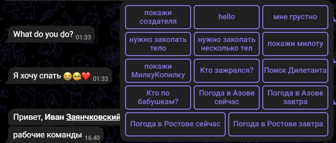

# Description
This bot works in Russian and in English. It is based on neural network transformer models.
The bot has built-in buttons (I trained to use the telebot library).

To see the working commands of the bot, type "/start"
---
# How to launch a bot
* Downloading the repository
* Creating a virtual environment
* install libraries from a file requirements.txt
* Enter the token of your telegram bot
'''
bot = telebot.TeleBot('TOKEN')
'''
>The token must be taken from @BotFather in a telegram
* run the file Telegram_Bot.py
